# Image Scanner

### By Leon Baird

This is an experimental software demonstrator. It shows how a system can be built for scanning and processing images and
media and run through a variety of enrichment and data extraction stages. A main job manager will scan for data and then
extract basic level meta data and security hashes from a given set of images, and will then process them against micro
services designed to receive the image and extract additional data from given media. The main job manager will store all
data in a postgres DB and allow a UI (provided) to run against the data set and visualise and search the extracted data.
Designed for using in phoresic investigations.

Services and data are connected throgh RabbitMq for messages relating to processing and extracting image data, REST for
frontend interface, and gRPC for further control and management of connected services.

This project supports Linux and MacOs, but may need additional work to support runing on Windows (not tested).

## Services provided in project

The following services have been provided to run the project and show the system.

| Service Name           | Description                                                                                                                                                                                 | Lang   |
| ---------------------- | ------------------------------------------------------------------------------------------------------------------------------------------------------------------------------------------- | ------ |
| service-jobs           | Main service runner and manager. Used for managing users, creating, running and deleting jobs. Will also perform scans of given media stores and manage storing and upating data in the DB. | NodeTS |
| service-exif           | Used to extract exif data from given media. (CPU Only)                                                                                                                                      | NodeTS |
| service-faces          | Used to extract face hashes and marquee boxes from given media. (CPU Only)                                                                                                                  | Python |
| service-classify       | Used to extract descriptive tags in text from given media. (GPU or CPU)                                                                                                                     | Python |
| service-shared         | Shared source code to be used between all NodeTS services for data extraction.                                                                                                              | NodeTS |
| service_python_sharfed | Shared source code to be used between all Python services fro data extraction.                                                                                                              | Python |

## Building and runinng project

When you have cloned the source code, you will need to prepare the projectg for building.

#### 1. Clone protos into build folders

```bash
./update_proto.sh
```

#### 2. Install docker

If you do not have docker installed, follow the [instructions](https://docs.docker.com/engine/install/) for installing
docker on your chosen platform.

#### 3. Pull required docker images

```bash
docker compose pull
```

#### 4. Build docker images

```bash
docker compose build
```

#### 5. Update docker compose file to add the following ENV Variables:

In the file `docker-compose.yaml`, for the frontend service, add the folowing ENV variables if you wish to support users
siging up and in using GIT or GOOGLE. You will need to seup OAuth accounts with github and google and copy the id and
secret into the env variables.

-   AUTH_GITHUB_ID=
-   AUTH_GITHUB_SECRET=
-   AUTH_GOOGLE_ID=
-   AUTH_GOOGLE_SECRET=

Frontend service uses Auth.JS, and you can change and update AUTH_SECRET= for a unique value from what is shipped with
the project. This is not essential and should run fine with given value. See documentation for Auth.JS should you wish a
unique value for any deployment situations.

In the RabbitMq and Postgres services, update credentials for User and Password as needed if securing the system.

#### 6. Setup image source folder

In the `docker-compose.yaml` file, under the `service_jobs` enter the path to the source folder for you media you wish
to scan.

The default is a git-ignored folder in the `service-jobs/sources` folder:

```
volumes:
    - ./service-jobs/sources:/app/sources # use this line to mount drives or folders to scan for source images
```

The web based software will display all folders immediately inside this folder to choose to scan, and then do a deep
hierarchical scan of the folder for data when running the job.

#### 7. Choose concurrency

In the `docker-compose.yaml` file, there are ENV variables which controll how many parallel jobs can run at once. By
default, the services will run on CPU and therefore the machine learning stages will be slow. If configured to run on a
GPU will be much faster, and therefore better at running more instances in parallel. However, for CPU support, depending
how many cores and processor speed of the CPU you have, running with a low value will be more reliable, whereas a highe
value may stall or crash the system, but be more performant. Default starting values are recommended as 8, with 80 the
max for a very powerful CPU with many cores. If the value is too high, the services may die during intense image
processing.

**RABBIT_MQ_PREFETCH_LIMIT** - how many messages to fetch at once and process in parallel.

Can be used on the following services ENV variables:

-   service-exif
-   service-faces
-   service-classify
-   service-jobs

#### 8. Run services

```
docker compose up
```

#### Dealing with build errors

If any services fail to build, usually this can be with subsequent updates and older versions being depricatged or not
available. Check out any error messages from docker, and explore the Dockerfiles to solve any build issues. Some build
issues may be specific to different platforms like MacOS or Linux. Only Windows has not been tested with this system for
building and runing. Also, if a service fails to build, try building it individually instead of together in bulk as this
sometimes helps.

```bash
docker compose build service_faces
```

## Running the UI

The following locations are used for accessing web based UI for controlling the services:

| Browser URL     | Service                                                                                            |
| --------------- | -------------------------------------------------------------------------------------------------- |
| localhost:3000  | Used for accessing main UI for image scanner                                                       |
| localhost:5555  | for Prisma Studio if running (run from a container or main OS if given the connection to postgres) |
| localhost:15672 | RabbitMq management software                                                                       |

### Signing in or creating an account

go to `localhost:300` in your browser (tested with Chrome).

If you have setup google or github OAuth credentials, you can sign in with those platforms, otherwise, you will need to
create an account using email and password credentials first, and then sign in.

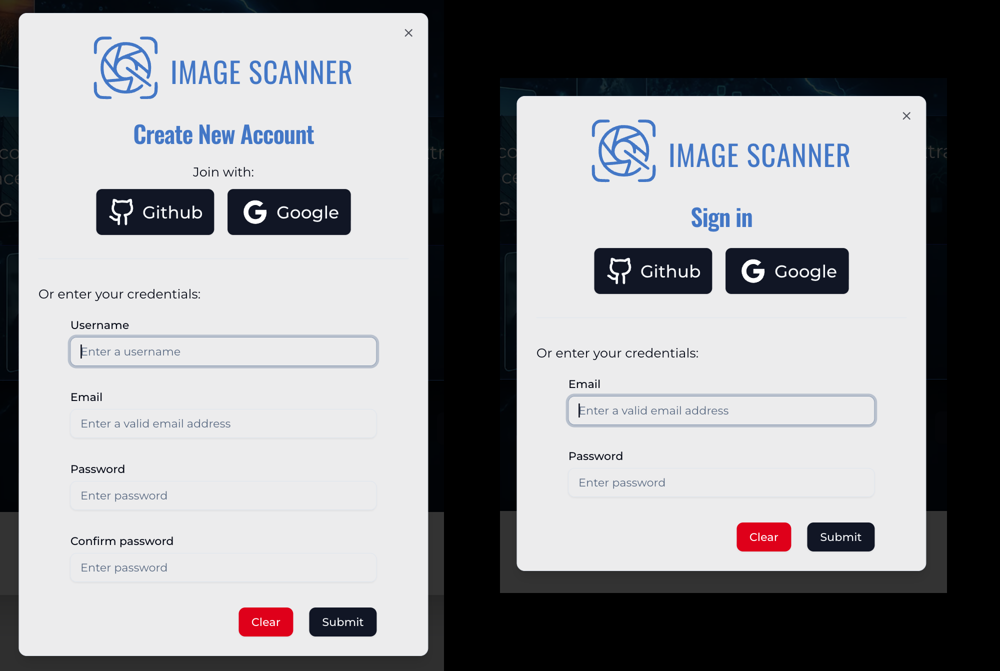

Once you have signed in, you will be greeted by the welcome screen for the main dashboard:

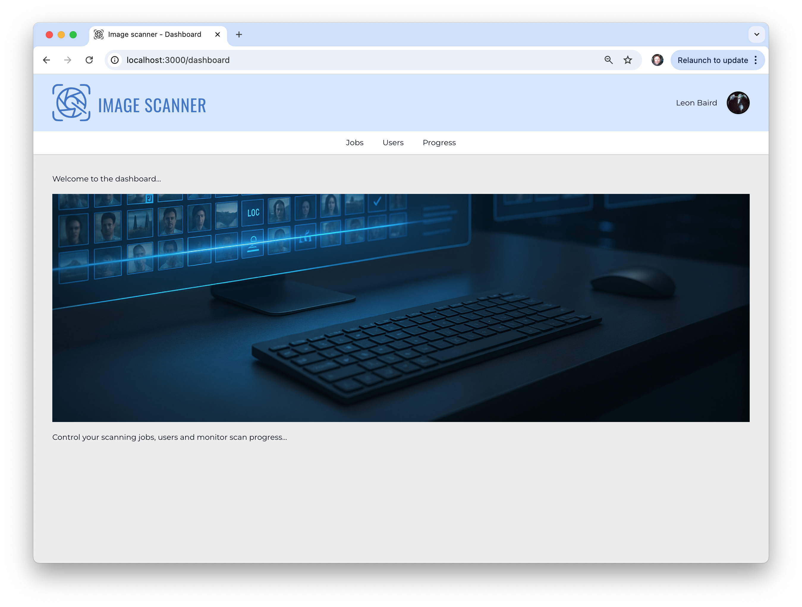

#### Signing Out

Once signed in, if you are using OAuth you may have a custom Avatar at the right side of the main page header. Otherwise
it will be a generic user icon if not avarat is provided by Github or Google. Click on this avatar to sign out and end
you session.

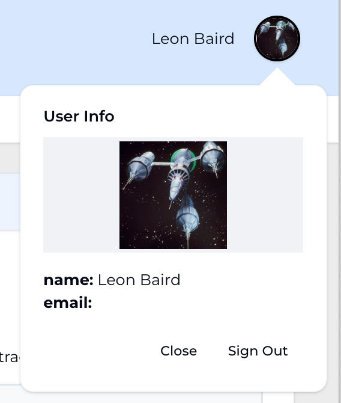

#### User Management

Currently on the users tab on the dashboard, only deleting users has been implimented.

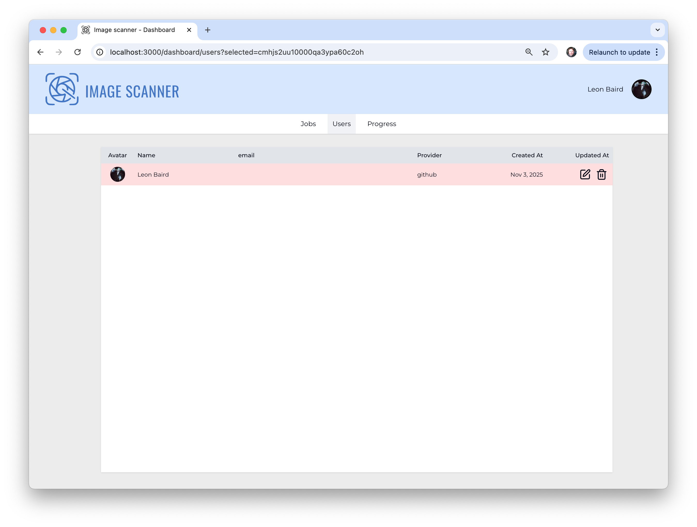

#### Managing Jobs

From the Job tab you can create and manage scanning jobs:

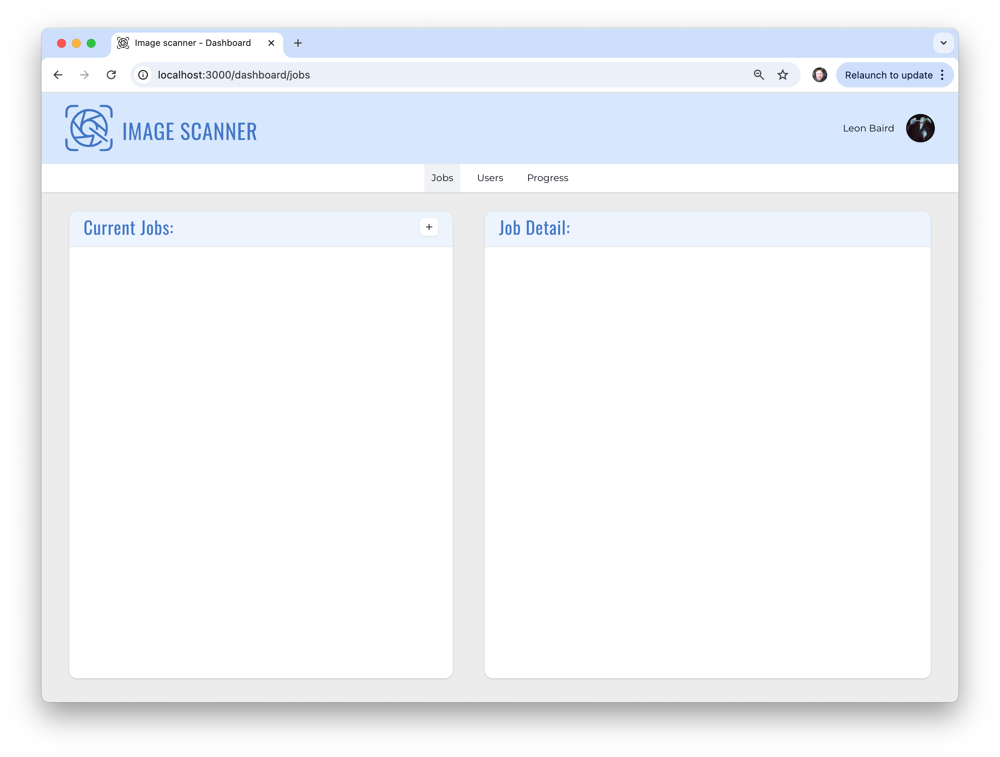

Press the (+) button on the "Current Jobs" header bar to add a new job, and then choose your source folder and enter job
details:

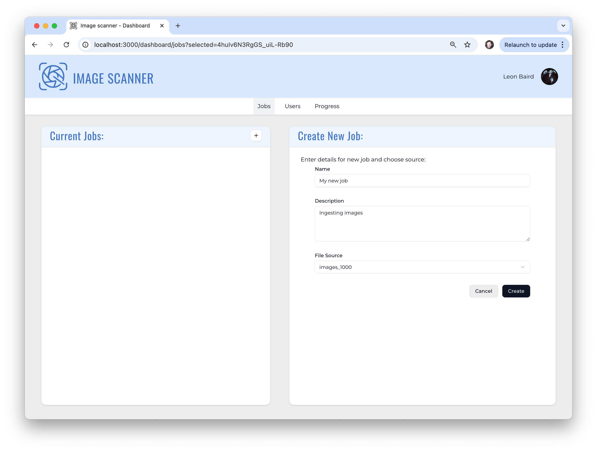

Once you have created a job, you will then see it's status icons. You can continue to add as many jobs as you like. It
is recommended to scan only one job at a time, thought the system should work with multiple jobs running. From the
status bar, the empty squares (see tooltips for what they represent) means the job has not started. If they are orange
they are currently running, and green means complete. The Play button with start a job scan and the process of finding
image media (JPEGS and PNG files) in your chosen source folder. The image icon will enter the image gallery, where you
can see scanned media and look at discovered media with whatever extracted data is ready to view.

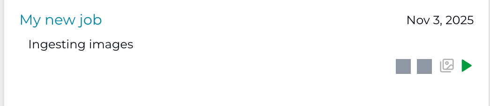

The above status is from a job not yet started, the following is a job where the file scanis complete (green) and the
data extracting is progressing (orange):

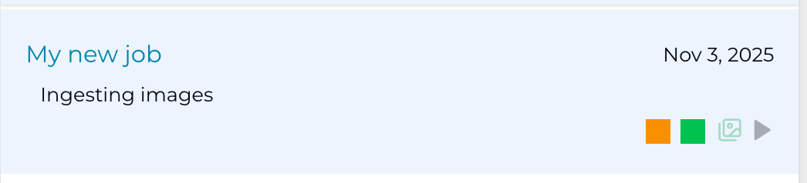

If the gallery button is green (after file scan), you can start to explore the discovered media in the gallery viewier.

#### Job Progress View

When you activate a job for scanning, it should automatically jump to the progress view. Firstly you will see a live
update as the file scan discovered media in your source folder:

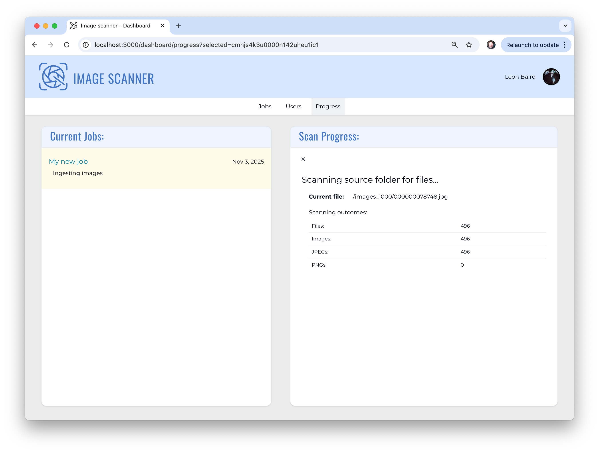

Once the file scan is completed, the progress will update to the data extraction info, where you will see a list of all
the services currently running and where they are at working through the discovered images:

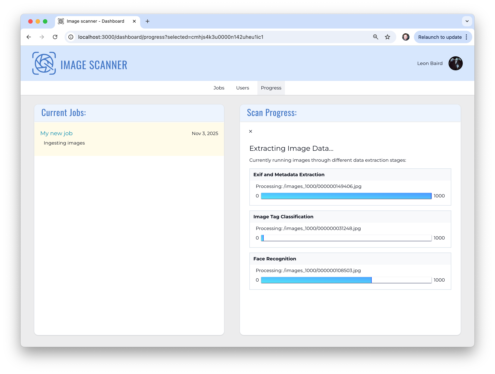

**NB** There is currently a known bug in the system, where during the scan progress, if you refresh the browser, you may
loose yout progress information until the scan has completed. This will not effect the scan in progress, just the live
updates you will see in your browser.

Once the scan is completed, or during, you can go to the Jobs manager and view the gallery of the job. Also, when the
job is complete, you can delete the job which will remove all available data for that job and image sources.

If the same media is scanned twice, it should avoid the data extraction stages as the MD5 hash is used to identify the
images and register extracted data against. This helps reduce the amount of data extraction if there are a lot of image
duplicates in a given data set.

#### Image Gallery

When the data is extracted and the job has competed scanning, you can use the image gallery to view the image data and
extracted data. Use the image icon in the job status on the Job Tab on the dashboard.


You can size the images with the size slider on the top right of the gallery, and click on an image will select the
image and display the data collected from the image.


In the left hand pane, there are four categories of extracted data, which may be present depending on the image. They
can display:

-   Basic Image Info
-   Extracted Exif and Meta Data
-   Location info
-   Faces

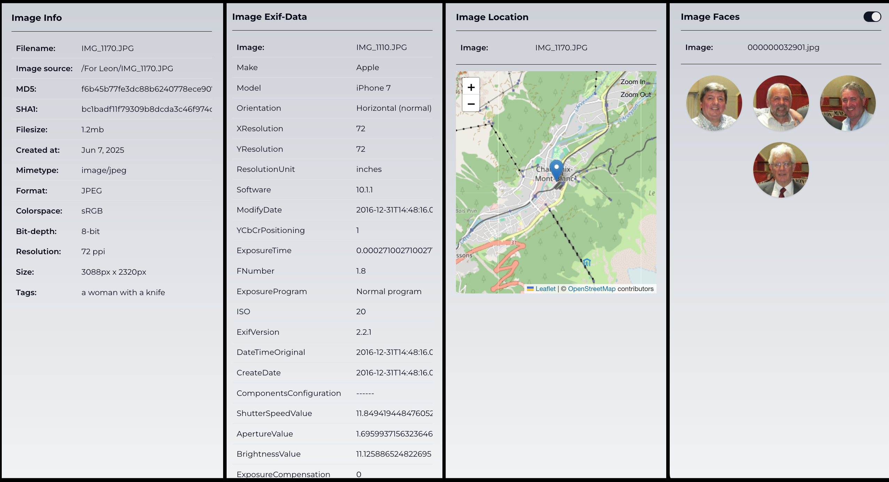

You can also show the face bounding box within the gallery by selecting `Image Faces` in the left panel for `Faces`:


When you wish to leave the gallery, the final option of `Dashboard` will be visible above the left hand pane.

## Adding additional data extraction stages

You can author the data extraction stages in any language you like, as long as they connect with RabbitMq to the job
manager. This project gives you tools to build the service in either Python (ideal for machine learning based data
extraction) or NodeTs (good for generic data extraction). You can use the `service-exif` as a template for the NodeTS
services, and use the `service-shared` folder for utilities. OR, you can use `service-classify` as a template for using
machine learning.

Once your service has been created, add it to the dockerfile so it will be run when the stack is mounted with docker
compose.

Also, once your source code is complete for your new data stage, go to this file to officially register the service with
the main Job Manager service. You may need to rebuild your docker compose services:
`service-job/src/configs/stages_data.ts`

example of stage data in `stages_data.ts`

```ts
    Classifier: {
        async streamImagesForProcessing(
            jobId: string,
            corrId: string,
            callback: ImageCallback,
            batchSize: number,
        ) {
            logger.info(
                `Streaming data for ${jobId} for classification processing in batches of ${batchSize}`,
                { id: 'StageDataHandler/Classifier/stream', corrId },
            );
            await streamImageDataForClassificationProcessing(jobId, batchSize, callback);
        },
        addDataToStore(incomingData: DataBlock) {
            const { md5, data, corrId, message, receiver } = incomingData;
            logger.debug(`adding data to store for classifications for image md5: ${md5}`, {
                id: 'StageDataHandler/Classifier/store',
                corrId,
            });
            addClassifyDataFromProcessing(md5, data, corrId, message, receiver);
        },
        async count(jobId: string, corrId: string) {
            const count = await countNumberOfTasksForClassificationProcessing(jobId);
            logger.debug(`Counted ${count} tasks for classification on job: ${jobId}`, {
                id: 'StageDataHandler/Classifier/count',
                corrId,
            });
            return count;
        },
    } as StageHandler,
```
